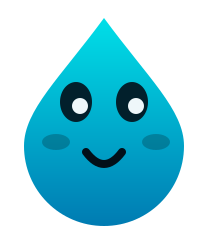
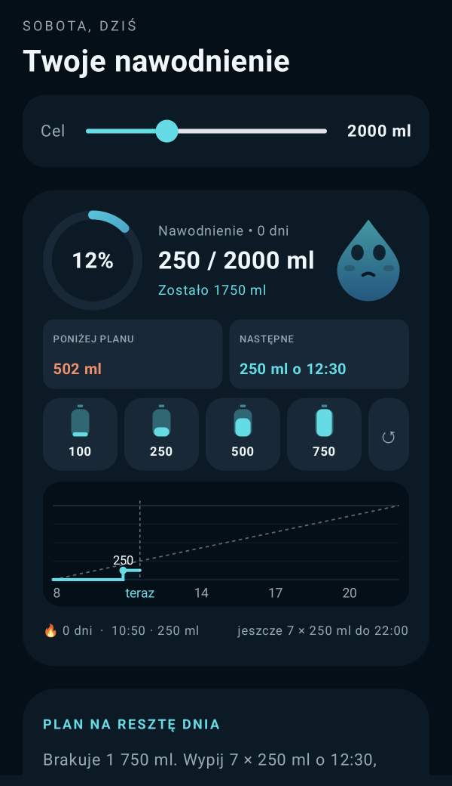
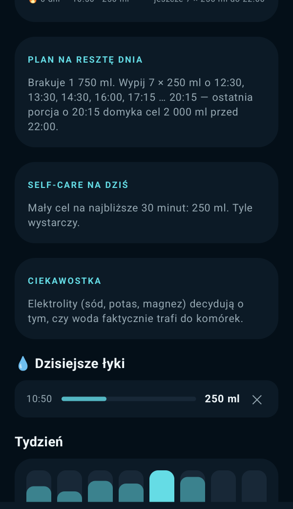
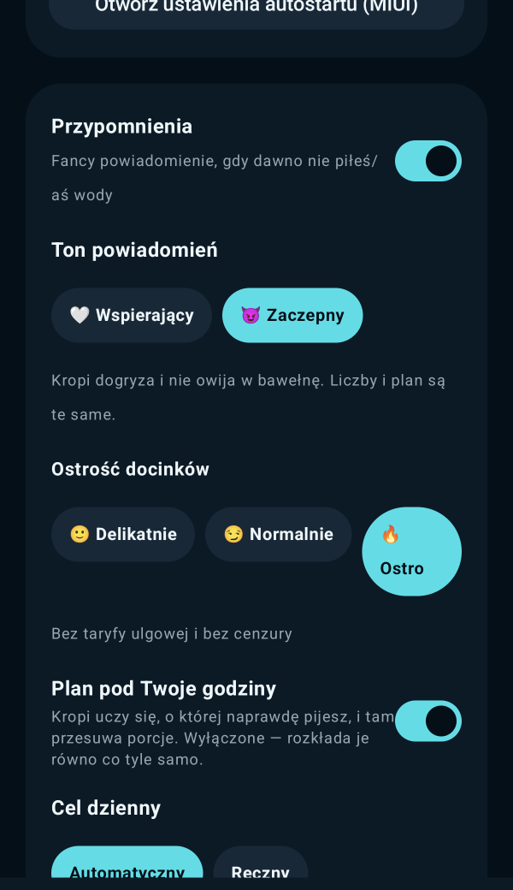
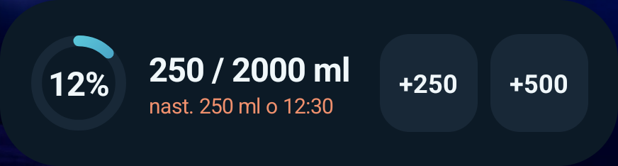
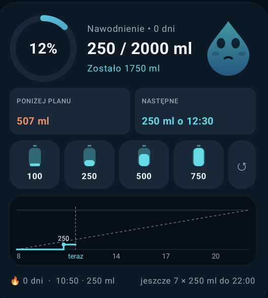

<div align="center">



# Kropi

**Water, with a plan.**
Not "remember to drink". Something you can act on: 250 ml at 3:10 pm, four more by 10 pm — and the day is done.

[Polski](README.md) · **English**

<br />

[](https://github.com/pi0trdotsys/Hydration-Buddy/releases/latest)
&nbsp;

&nbsp;


<br />


&nbsp;&nbsp;

&nbsp;&nbsp;


</div>

<br />

> **Heads up:** the app itself speaks Polish only for now. The screenshots and
> quotes below are translated. English is next on the list — the groundwork is
> there, the strings just need a second language.

<br />

## ◉ A plan, not a nag

Every water app can type "drink something". Kropi works out **how much and
when**, so the day actually closes:

> **💧 Really, is it that hard?** · 10% • goal 2,500 ml
> Drink 250 ml at 3:40 pm — plus eight more by 10 pm, and 2,500 ml is done.

The plan takes your goal, your drinking window and your glass size, splits what
is missing into even portions and hands you the times. When the day is running
out, it makes the portions bigger instead of promising a goal you cannot hit.
Expand the notification and you get the whole schedule, where you stand against
the pace for this hour, and how long it has been since your last sip.

The action button logs **exactly the portion the plan calls for** — one tap and
you are back to whatever you were doing.

## ◉ A widget that actually tells you something

<div align="center">

</div>

Not just a percentage, and not anonymous bars. The large tile draws a **stepped
hydration line**: every step is one sip, labelled with its volume, on an axis
with hours and a "now" marker. A dashed **plan line** runs alongside it, so you
can see at a glance whether you are above or below it.

Two status pills sit on top: `BELOW PLAN / 507 ml` (orange when you are behind)
and `NEXT / 250 ml at 12:30`. The footer carries your streak, the last logged
sip and how many portions are left today.

Four log buttons live on the tile, so **water gets logged without opening the
app**. Tapped the wrong one? Undo sits right next to them. Three layouts —
a 4×1 bar, a 2×1 tile and a full 2×2 — each showing as much as it can fit.

<div align="center">

</div>

## ◉ Kropi bites. Or doesn't — your call

The mascot has two personalities. **Supportive** talks to you like a friend
after a workout. **Snarky** does not sugar-coat anything:

> Four hours without water. Your kidneys have just filed for unpaid leave. Even
> instant noodles get more water than you. Get up and drink. I won't repeat
> myself.

Snark comes in three levels: 🙂 **mild** (a jab, no harsh words), 😏 **normal**
and 🔥 **savage** — that last one is uncensored, so you turn it on deliberately.
The line is picked from how far you are from your goal and how long you have
gone dry. The numbers and the plan stay the same; only the tone changes — the
mascot inside the app included.

In the evening, once your drinking window closes, a **daily wrap-up** arrives:
the balance, how many sips, your streak, and a comment in whichever tone you
picked.

## ◉ It learns your hours

Kropi remembers when you **actually** drink and moves the portions there,
instead of spreading them evenly across the day. Same goal, two different
people:

```text
early riser   08:00  08:30  09:00  12:00  13:00  17:30
night owl     09:20  16:30  18:30  19:00  19:30  20:15
```

The first portion never lands later than an even split would put it — so "I
only drink in the evening" doesn't get baked in for good. Not your thing? One
switch in Settings and the even rhythm is back.

## ◉ Water without opening the app

- **Widget** — four buttons on your home screen, volumes are yours to set.
- **Quick Settings tile** — one tap from the shade, with the day's balance in
  the subtitle.
- **Launcher shortcuts** — long-press the icon and pick "Glass" or "500 ml".
- **Notification** — one button logs the planned portion, the other snoozes the
  reminder for 20 minutes.

## ◉ A goal calculated for you

Give it your weight, the ambient temperature and your activity level — Kropi
works out the goal (roughly 33 ml per kilogram, plus a bump for heat and
effort). Prefer your own number? Manual mode with a slider. On top of that,
**active drinking hours**, say 8 am to 10 pm: reminders and pace only count
inside that window, outside it Kropi leaves you alone.

## ◉ History that doesn't lie

Every closed day goes into history: how much you drank, what the goal was,
whether you made it. The week, the **last 30 days**, your best day and your
**streak** — all computed from real entries, not from sample data. A mistake is
one tap away from being deleted on the day's timeline, and the whole thing
exports to **CSV** without any storage permissions.

## ◉ Works with Szpila

Running [Szpila](https://github.com/pi0trdotsys/Glow-Habit-Widget)? Water logged
in Kropi **lands there by itself** — no more typing the same thing twice. Every
entry refreshes Szpila's habit and widgets right away, even while it is closed.
The data travels locally, through a provider guarded by a signature-level
permission: only Szpila can read it, and nothing leaves your phone.

<br />

---

<br />

## ▸ Install

1. Grab the **`kropi-hydration-….apk`** file from
   [Releases](https://github.com/pi0trdotsys/Hydration-Buddy/releases/latest).
2. Open it on your phone and allow installs from that source.
3. Launch Kropi, accept notifications and head into Settings.

Android 8.0 or newer. Updates install over the top — your data stays put.

## ▸ The first two minutes that matter

|     | Where                                                        | Why                                                |
| --- | ------------------------------------------------------------ | -------------------------------------------------- |
| 🔔  | Allow notifications                                          | Reminders with a plan, plus the daily wrap-up      |
| ⚖️  | Settings → weight, temperature, activity                     | A goal calculated for you                          |
| 🕗  | Settings → **active drinking hours**                         | Reminders only when you want them                  |
| 😈  | Settings → **notification tone**                             | Supportive or snarky, in three levels              |
| ➕  | Long-press home screen → **Widgets** → Kropi                 | Logging in a single tap                            |
| ⚡  | Quick Settings → edit tiles → **Kropi**                      | Water straight from the shade                      |
| 🔋  | System settings → Battery → Kropi → **Unrestricted**         | Reminders on time (Xiaomi, POCO, Samsung)          |

## ▸ Your data is yours

Everything stays on the phone. **No account, no cloud, no ads, no tracking** —
the app doesn't even need an internet connection. Export your history to CSV
whenever you like. The only thing that ever leaves Kropi is the water handed
locally to Szpila, if you happen to run it.

<br />

<div align="center">

**Kropi** · water, with a plan


</div>

<br />

<details>
<summary><b>For developers</b></summary>

<br />

The repository holds two things rendering the same design:

- **`android/`** — the real app: Kotlin, Jetpack Compose, a Glance widget,
  state in DataStore, reminders on WorkManager. No network dependencies at all.
- **`src/`** — the web mockup (TanStack Start + React) the design system came
  from: palette, progress ring, mascot and tile layout.

Where the interesting parts live:

| File | What it does |
| --- | --- |
| [`data/HydrationPlan.kt`](android/app/src/main/kotlin/com/kropi/hydration/data/HydrationPlan.kt) | Spreads portions over the day, including the adaptive mode (quantiles of the hourly profile) |
| [`data/HydrationRepository.kt`](android/app/src/main/kotlin/com/kropi/hydration/data/HydrationRepository.kt) | Today's state, 400 days of history, streak, hourly profile |
| [`data/SnarkContent.kt`](android/app/src/main/kotlin/com/kropi/hydration/data/SnarkContent.kt) | Kropi's second personality: titles, jabs and closers across three snark levels |
| [`widget/HydrationWidget.kt`](android/app/src/main/kotlin/com/kropi/hydration/widget/HydrationWidget.kt) | The Glance widget in `SizeMode.Exact`; state collected as a `Flow` **inside** `provideContent` |
| [`widget/WidgetGraphics.kt`](android/app/src/main/kotlin/com/kropi/hydration/widget/WidgetGraphics.kt) | `IntakeChart` — the day's chart drawn by the same code onto a bitmap (widget) and a `Canvas` (app) |
| [`export/HydrationExportProvider.kt`](android/app/src/main/kotlin/com/kropi/hydration/export/HydrationExportProvider.kt) | Read-only provider for Szpila, guarded by a signature-level permission |

```bash
cd android
./gradlew :app:assembleRelease
./gradlew :app:testReleaseUnitTest
adb install -r app/build/outputs/apk/release/app-release.apk
```

JDK 21 and Android SDK 36 required. Releases are signed with a single key, so
updates install without uninstalling first.

Web mockup: `bun install && bun run dev`.

</details>
