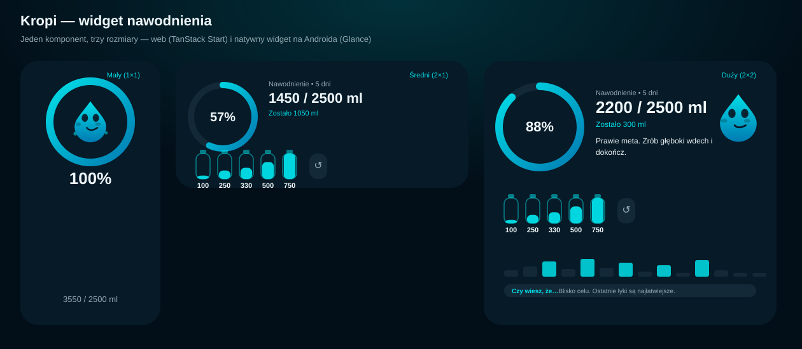
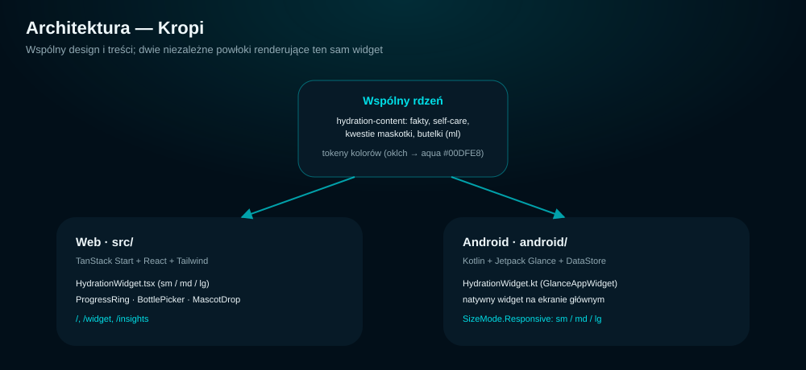

# Hydration Buddy — Kropi

Zaplanuj mi makiety do aplikacji mierzącej nawodnienie. Przede wszystkim skalowalny widget, material, minimalistic, tech fancy design, komentarz na widgecie i na ekranie głównym z self-care + ciekawostka o nawodnieniu, piciu wody (obszerny zestaw). Klikalne butelki na widgecie (różne pojemności) + progress wypicia wody danego dnia oraz jakiś smaczek (w stylu maskotka itp.)



Jeden design, jeden komponent — renderowany na dwóch platformach:

- **Web** (`src/`) — makiety TanStack Start/React: dashboard, podgląd widgetu w 3 rozmiarach (`/widget`) i pełna lista ciekawostek (`/insights`).
- **Android** (`android/`) — natywny, skalowalny widget na ekran główny zbudowany w Kotlinie z Jetpack Glance, 1:1 odwzorowujący design z makiet, z prawdziwą interakcją (dolewanie wody, licznik dnia, maskotka) i zapisem stanu w DataStore.



This project was built with [Lovable](https://lovable.dev).

## Build with Lovable

Continue developing this project in the [Lovable editor](https://lovable.dev/projects/a413940b-41b3-4aa0-9cf4-a633574bc5ff).

- **Ship faster**: describe what you want to build and Lovable handles the code.
- **Stay in sync**: every change made in Lovable is committed straight to this repository.
- **Full ownership**: this code is yours. Push to `main` on GitHub and your changes sync back into Lovable, ready for your next prompt.

## Development

Prefer working locally? You need Node.js and npm — [install with nvm](https://github.com/nvm-sh/nvm#installing-and-updating).

```sh
git clone <this-repository-url>
cd <repository-name>
npm i
npm run dev
```

## Natywny widget na Androida

Kod w [`android/`](android/) to osobny projekt Gradle/Kotlin (Jetpack Glance + Compose + DataStore), niezależny od aplikacji webowej powyżej, ale renderujący ten sam design.

- `HydrationWidget.kt` — `GlanceAppWidget` z `SizeMode.Responsive` (sm/md/lg), z pierścieniem postępu i maskotką renderowanymi na bitmapie (Glance nie ma dostępu do dowolnego Canvasu) oraz klikalnymi butelkami zbudowanymi z natywnych komponentów Glance.
- `HydrationRepository.kt` — stan (cel, łyki, streak) trzymany w Jetpack DataStore, z rolowaniem dnia o północy — odpowiednik `useHydrationMock`, ale z realnym zapisem między sesjami.
- `HydrationContent.kt` — 1:1 port `src/data/hydration-content.ts` (ciekawostki, self-care, kwestie maskotki).
- `MainActivity.kt` — ekran hosta z podglądem wszystkich trzech rozmiarów (odpowiednik `/widget`) i przyciskiem, który przypina widget na ekran główny (`requestPinAppWidget`).

Uruchomienie lokalnie (wymaga Android SDK):

```sh
cd android
./gradlew :app:assembleDebug
adb install -r app/build/outputs/apk/debug/app-debug.apk
```
